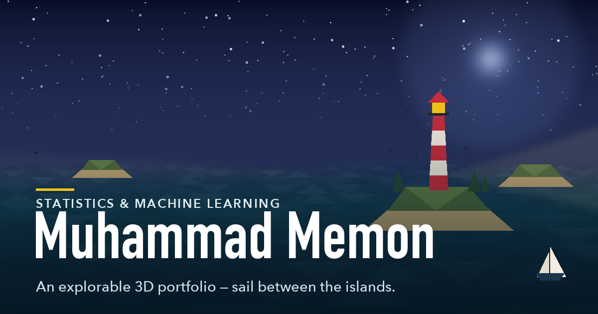

# Muhammad Memon — Portfolio

An explorable, low-poly **3D archipelago** you sail through to discover a portfolio.
Each island is one chapter — resume, about, projects, leadership, contact — and four
message-in-a-bottle notes drift somewhere out at sea.

Built with [Three.js](https://threejs.org/) and plain ES modules. **No framework, no
build step, no dependencies to install.**



### What's interesting about it

- **Everything is generated in code.** There are no image files or textures in the
  scene — islands, trees, monuments, the boat and the parchment map are all built from
  geometry at runtime, seeded so the world is identical on every load.
- **The map is drawn from the real world.** The scroll map isn't hand-drawn; it slices
  the actual island meshes at the waterline, so the coastlines always match what you sail past.
- **The sea is a playground.** Rafts of barrels and crates scatter and tumble when you
  plough through them — lighter cargo gets thrown further and barely slows you, while the
  moored buoys shrug you off. There's a wrecked ship listing in open water, dolphin pods
  that breach and splash, and a rubber duck hidden well offshore.
- **One wave function, two places.** The same maths runs in GLSL on the GPU (the water
  surface) and in JS on the CPU (boat, buoys, bottles), so everything floats on the same swell.
- **It degrades well.** Without WebGL — or if the GPU context is lost — it falls back to a
  clean text version of the same content. It's keyboard-navigable, screen-reader labelled,
  and honours `prefers-reduced-motion` and `prefers-color-scheme`.
- **Quality adapts.** The renderer lowers its pixel ratio if the frame rate drops.

## Running locally

ES modules must be served over HTTP (opening `index.html` from the filesystem won't
work). A zero-dependency server is included:

```bash
npm run dev
```

Then open <http://localhost:5173>. There is no `npm install` step — the scripts use only
Node's standard library. Any static server works too, e.g. `python3 -m http.server 5173`.

### npm scripts

| Script | What it does |
| --- | --- |
| `npm run dev` | Static dev server on port 5173 (`PORT` or an argument overrides it) |
| `npm run check` | Health check: JS syntax, broken asset links, manifest, resume, social card |
| `npm run set-site-url <url>` | Bakes your real domain into the canonical/OG/JSON-LD tags, `robots.txt` and `sitemap.xml` |
| `npm run icons` | Regenerates `og-image.png`, the favicons and PWA icons (needs Python + Pillow) |

## Deploying

**Set the site URL first.** Social scrapers don't run JavaScript and need absolute URLs,
so the share card won't work until you do this:

```bash
npm run set-site-url https://your-domain.com
```

Then publish the repository root as a static site — there's nothing to build:

- **Netlify** — `netlify.toml` is included with caching and security headers.
- **Vercel / Cloudflare Pages** — works with zero configuration; set the output directory to the repo root.
- **GitHub Pages** — serve from the branch root. Relative paths mean project sites
  (`user.github.io/repo/`) work fine; only `404.html`'s "back to harbor" link assumes a root domain.

`.github/workflows/ci.yml` runs `npm run check` on every push and pull request.

## Project structure

```
.
├── index.html               Markup, metadata, and script/style links
├── 404.html                 Styled "off the chart" page
├── styles/
│   ├── base.css             Design tokens (light/dark), resets, canvas
│   ├── hud.css              HUD, day/night switch, stats, scroll map, labels
│   ├── overlays.css         Dock, side panel, intro, hint/toast/joystick
│   ├── reader.css           Plain-page + printable resume + no-WebGL fallback
│   └── responsive.css       Narrow-viewport, touch, reduced-motion overrides
├── src/
│   ├── content.js           All site copy — the single source of truth
│   ├── utils.js             Pure helpers: seeded RNG, math, the wave function
│   ├── main.js              The app: scene, boat, physics, UI, map, render loop
│   └── scene/
│       ├── primitives.js    Shared materials, unit geometry, mesh + batching helpers
│       ├── water.js         The custom water shader
│       ├── monuments.js     Per-island landmarks (lighthouse, cabin, observatory…)
│       ├── flotsam.js       Buoys, barrel/crate rafts, the wreck, the rubber duck
│       ├── wildlife.js      Circling gulls and breaching dolphin pods
│       └── palette.js       Day / dusk / night colour stops
├── vendor/three.min.js      Three.js r128 (MIT)
├── assets/
│   ├── Muhammad_Memon_Resume.pdf
│   └── icons/               Apple touch icon + PWA icons
├── scripts/
│   ├── serve.mjs            Dependency-free dev server
│   ├── check.mjs            Project health check (used by CI)
│   ├── set-site-url.mjs     Stamps the public URL into the metadata
│   └── generate-icons.py    Draws the social card and icon set
└── og-image.png, favicon.*, site.webmanifest, robots.txt, sitemap.xml
```

## Phones and performance

The scene is fragment-bound, so a phone's limited fill rate — not its CPU — is what
costs frames. [`src/scene/quality.js`](src/scene/quality.js) picks one of two tiers at
startup (mobile UA, iPadOS touch points, coarse pointer, ≤4 cores or ≤4 GB → low), and
everything expensive scales off it:

| | Desktop | Phone |
| --- | --- | --- |
| Pixel ratio cap | 2 | 1.5 |
| MSAA | only below pixel ratio 2 | off (pixel-ratio supersampling instead) |
| Shadows | 2048px, soft (PCFSoft) | 1024px, hard (PCF) |
| Water mesh | 256² segments | 144² |
| Water shader | full | skips the sun sparkle and colour noise |
| Flotsam | 5 rafts + 7 singles, casts shadows | 3 rafts + 4 singles, no shadow casting |
| Stars / clouds / wake / dolphin pods | 700 / 14 / 110 / 3 | 350 / 8 / 60 / 2 |

On top of that the renderer drops its pixel ratio automatically if the average frame time
stays above 25 ms, so a weak device recovers even if the tier guessed too generously.

**Controls follow the input, not the device.** The on-screen steering wheel never appears
on a computer. `(pointer: coarse)` alone isn't a safe test — a touchscreen laptop can
report a coarse primary pointer while someone sits in front of it with a mouse — so the
initial check also requires that no fine pointer exists at all. After that the mode
follows real input: touch the screen and the wheel appears, reach for the mouse or
keyboard and it disappears again (and the instructions swap between "steer with the
wheel" and "sail with WASD").

Two mobile-specific details worth knowing:

- The canvas is sized from **`visualViewport`**, not `innerWidth`/`innerHeight`. On iOS
  Safari the latter includes the strip behind the URL bar, which makes the canvas taller
  than the visible area and pushes the HUD off screen.
- Mobile browsers fire `resize` continuously while that URL bar animates, so the cheap
  work (canvas + camera) runs on every event while layout measuring is **throttled** until
  the resize settles.

The tier approach and the `antialias` rule follow Bruno Simon's
[folio-2025](https://github.com/brunosimon/folio-2025) (`Game/Quality.js`, `Game/Viewport.js`,
`Game/Rendering.js`).

## Editing the content

All visitor-facing text lives in [`src/content.js`](src/content.js) — islands, project
write-ups, the resume, and the bottle notes. Nothing else needs to change.

- **Islands** define `pos` (`[x, z]` in world units; the world is ~470 across), `r`
  (radius), `pier` (pier direction in radians) and `kind`, which selects the monument
  built by `src/scene/monuments.js`.
- **Resume** — the on-screen "Logbook" view is rendered from structured data. The
  downloadable PDF lives in `assets/` and its name comes from `resume.filename`; drop in a
  new PDF, update that field, and `npm run check` will confirm the two agree.
- **Project links.** Hiring managers consistently rank a live demo or public source as
  the thing they most want on a project. Any island accepts a `links` array — the first
  entry renders as the primary button, the rest as outlines, and external links open in a
  new tab. There's a commented example on the Lectra island ready to fill in:

  ```js
  links: [
    { label: 'Live demo', href: 'https://lectra.your-domain.com' },
    { label: 'Source', href: 'https://github.com/Muhammad-Memon542/lectra' }
  ]
  ```

- After changing your name or tagline, re-run `npm run icons` to redraw the social card.

## How it fits together

`index.html` loads the stylesheets, then `vendor/three.min.js` as a classic script (which
defines the global `THREE`), then `src/main.js` as a module. Module scripts are deferred,
so both `THREE` and the DOM are ready by the time the app runs.

`main.js` owns the runtime — scene, boat physics, autopilot, overlay UI, the parchment map
and the render loop — and pulls in copy from `content.js`, pure helpers from `utils.js`,
and the scene layers from `src/scene/`. Shared state is passed in explicitly: monuments
receive the `animators` list and beam material rather than reaching for globals.

**Three.js is pinned to r128.** The water material patches Three's built-in shader through
`onBeforeCompile`, relying on chunk names and `gl_FragColor` semantics that later releases
changed. Upgrading means reworking `src/scene/water.js`.

## Credits & license

- 3D rendering by [Three.js](https://threejs.org/) r128 (MIT), vendored in `vendor/three.min.js`.
- Typography via Google Fonts: Atkinson Hyperlegible, Big Shoulders Display, IM Fell English.
- Application code © Muhammad Memon, MIT licensed — see [LICENSE](LICENSE).
